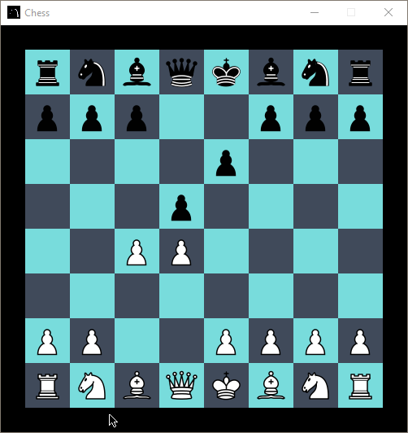

# Chess
Trying to recreate the game chess (without the chess library)

screenshot:

done:
- Board 
- add pieces
- moveset of pieces

Goals:
- Pieces move correctly 
- castle, enpassant etc
- show legal moves
- preventing player from not deffending king(illegal)
- show check/checkmate
- show previous move
- surrender button
- clock(+increment)
- sounds
- different game modes
- bots
- turn board
- online?
- ?

img:
By en:User:Cburnett - Own workThis W3C-unspecified vector image was created with Inkscape., CC BY-SA 3.0, https://commons.wikimedia.org/w/index.php?curid=1499809
All the pieces are from this entity

For anyone reading this. Sorry for the spelling mistakes that might be there. It wasn't a priority to me as this is just a project for me to learn how to program.
